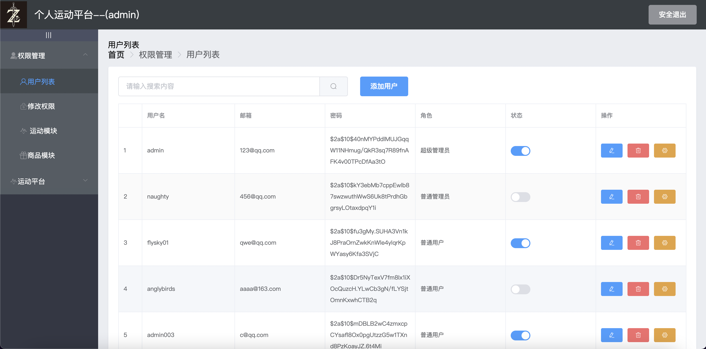
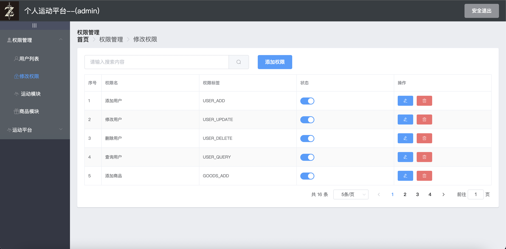
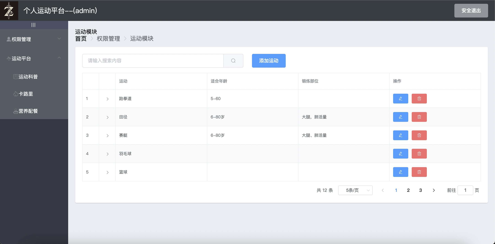
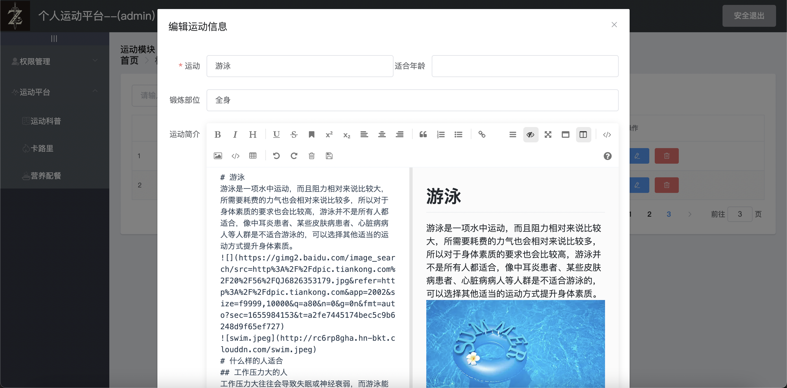
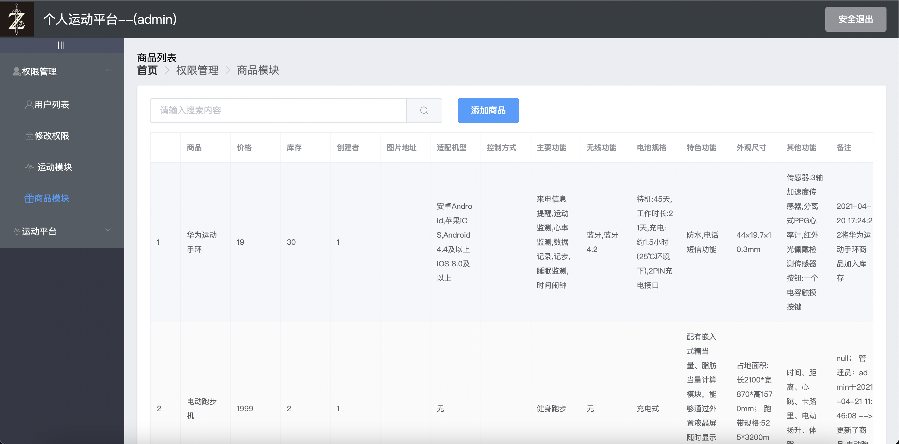

#### 已完成功能
- [x] 登陆登出
- [x] 权限管理-用户列表的增删改查
- [x] 权限管理-权限列表的增删改查
- [x] 权限管理-运动列表的增删改查
- [x] 权限管理-商品列表的增删改查
- [x] 运动平台-食物列表的增删改查
- [ ] 运动平台-运动科普

#### 登陆/登出
- ~~获取前端返回的用户名密码,与数据库进行匹配;匹配成功则返回用户信息。~~
- 数据库中存储加密后的密码;
- 使用Spring Security+jwt进行登陆。
- 登陆请求到达后,首先到达JwtAuthenticationFilter
  - 如果用户初次登陆未携带token,请求将到达LoginController;LoginController将在数据库或redis缓存中查询用户信息,如果找到用户&密码正确&账号未被禁用,则登陆成功,在SecurityContextHolder中存入登陆信息,并根据登陆信息获取token,返回tokenHead和token。
  - 如果不是初次登陆,token存在但SecurityContextHolder中没有登陆信息,则将通过自定义的UserDetailServiceImpl的loadUserByUsername方法,从数据库或redis缓存中查询用户信息,将User放入SecurityContextHolder
- 登出时,前端清空sessionStorage,后端清空SecurityContextHolder

#### 用户列表
- 获取所有用户信息
- 只有管理员/超级管理员才能看到该页面
- 只有超级管理员具有删除用户和修改用户角色的权限
- 界面效果如下:
  

#### 权限列表
- 获取所有权限信息
- 只有超级管理员才能看到该页面, 管理员不能看到
- 界面效果如下:
  

#### 运动列表
- 获取所有运动信息
- 只有管理员/超级管理员才能看到该页面
- 只有超级管理员具有删除运动信息的权限
- 运动简介增和了markdown,可以通过markdown
编辑,markdown也支持上传图片到七牛云/图片链接
- 界面效果如下:
  
- markdown编辑效果如下:
  

#### 商品列表
- 获取所有商品信息
- 只有管理员/超级管理员才能看到该页面
- 只有超级管理员才有删除商品的权限
- 界面效果如下:
  

#### 食物管理
- 获取所有的食物信息,可以进行食物管理(食物信息的增删改查),也可以进行分类管理(食物分类信息的增删改查)
- 食物管理可以通过excel批量上传,excel中的食物图片被保存在七牛云中(30天有效的测试域名)
- 目前每个食物只支持单张图片
- 只有超级管理员才有删除菜品的权限
- 界面效果如下: 

